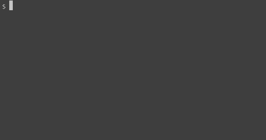

# Contributing

When contributing to this repository, please first discuss the change you wish to make via issue,
email, slack, or any other method with the owners of this repository before making a change.

## Getting started

Run `npm install` to install dependencies, followed by `npm run start`: this will run storybook on your machine

## Conventions and rules

While developing we use the following conventions and rules to develop components.

### Packages

- _asc-assets_ contains icons and fonts. This package can be used standalone in other projects that
  are not using Amsterdam Styled Components.
- _asc-ui_ is the main package where we develop our components.

### <a name="aligning"></a> Aligning with Design System

It's important to check if the component is already included in the [design system](https://designsystem.amsterdam.nl/7awj1hc9f/p/39359e-design-system).
If so, please create the component as it's designed in there. In case you have questions or the component doesn't exist, please contact one of the [maintainers](./MAINTAINERS.md) to get access to the [DTS slack group](https://dstamsterdam.slack.com)

** Important note **: Please keep in mind that in the design system everything is designed on a 5px grid, but in this repo, the default (themeSpacing) is 4px.
For example, if you see a component with a 15px padding, you'll probably want to either use 16px (`padding: ${themeSpacing(4)}`) or 12px (`padding: ${themeSpacing(3)}`).

### File structure and content

A typical structure of a component would look like this

```
+-- asc-ui
|   +-- src
|   |   +-- components
|   |   |   +-- Footer (1)
|   |   |   |   +-- Footer.tsx (2)
|   |   |   |   +-- FooterStyle.ts (3)
|   |   |   |   +-- FooterStyle.test.tsx (4)
|   |   |   |   +-- index.ts (6)
|   |   +-- index.ts (7)
```

1. This it the directory containing the component's name
2. This is the React component. This uses the \*Style.ts component
3. This file contains styled-component related stuff, and **no react** code.
4. This contains necessary tests
5. Stories for storybook. Please add a `.mdx` file in the `/stories/src` directory including a link
   to the design system page (if available)
6. This will contain a default export, pointed to the .tsx file (2). If needed, you can also
   re-export the \*Style.ts file.
7. Eventually, we need to make our component available to use in other project, so we import
   the corresponding component's default `/packages/asc-ui/src/index.ts` and make it available in the export.

**Pro tip!** Use generators to quickly add the needed files to develop components.
To make life a little easier, we added [hygen](https://www.hygen.io/). Simply run
`hygen component new`. You will be prompted with questions the generator needs to build the files
for the new component. For more info possibilities, check the hygen documentation.



### Locally link this repo to your project while developing

Something you want to see your changes immediately in your project. Follow these steps to link asc
to your project.

1. Run `npm run build:watch`, this will watch your files and transpile them to the package lib
   directory.
2. cd to the package you want to test, run `npm link`.
3. Go to the repo where you want to use your package and run
   `npm link <package-name>`. The `<package-name>` can be found in the `package.json` you linked in
   step 2.

Now you can import the package like you would do like a normal npm dependency. Changes you will make
in your package will be seen in your repo.

Example: linking the `asc-ui` package.

```
cd amsterdam-styled-components/packages/asc-ui  # go into the package directory
npm link                                        # creates global link
cd path-to-your-main-project                    # go into the dir of your main project
npm link "@amsterdam/asc-ui"                    # link-install the package
```

There is a known issue when developing with `npm link` and using Hooks
[(click here for details)](https://reactjs.org/warnings/invalid-hook-call-warning.html). The cause
is that two React instances are used when using `link`. To solve this problem add this code to `webpack.common.js`:

```javascript
  resolve: {
    modules: ['node_modules'],
    extensions: ['.js', '.jsx'],
    alias: {
      react: path.resolve('./node_modules/react'),
      'react-dom': path.resolve('./node_modules/react-dom'),
    },
  },
```

## Pull Request Process

1. Ensure any install or build dependencies are removed before the end of the layer when doing a
   build.
2. Update the [CHANGELOG.md unreleased sections](../CHANGELOG.md#user-content-unreleasedd) with
   details of changes, this includes additions (new components or (theme) configurations), changes
   and removals.
3. Once your PR is approved and merged, you can bump a version yourself or contact one of the
   [core maintainers](./MAINTAINERS.md) to discuss the version to bump. The versioning scheme we
   use is [SemVer](http://semver.org/).

## Publishing

For now, only core maintainers can publish. If you want have rights to publish as well, contact one
of the [core maintainers](./MAINTAINERS.md). To publish these packages to npm, follow these steps:

### Publish canary version

1. Make sure you're logged in to npm, by running `npm login`
2. Run `npm run publish:canary`. This will run linters and tests before the lerna prompt,
   so be patient :smile:
3. This canary version is now available for usage in any local or demo version of your project, but not tagged with the `@latest` tag on npm. So use for example `npm install @amsterdam/asc-ui@canary`.

### Publish stable version

1. Make sure you're logged in to npm, by running `npm login`
2. Run `npm run publish:stable`. This will run linters and tests before the lerna prompt,
   so be patient :smile:
3. Select a version
4. Once published, update the [changelog](../CHANGELOG.md) and move all the bulletpoints under the
   Unreleased section to the corresponding file.
5. Go to the [tags of the repository](https://github.com/Amsterdam/amsterdam-styled-components/tags) and create a release of the latest version.

## Troubleshooting

Sometimes you either can't build the project or run tests properly. Usually this is due to the fact
that a package is updated or you're not using the right node version. Please check if this is the
case. Otherwise just run this command (if you are using nvm):
`rm -Rf node_modules && nvm install 16 && nvm alias default 16 && npm i`

Still having trouble? Contact one of our [core maintainers](./MAINTAINERS.md)
